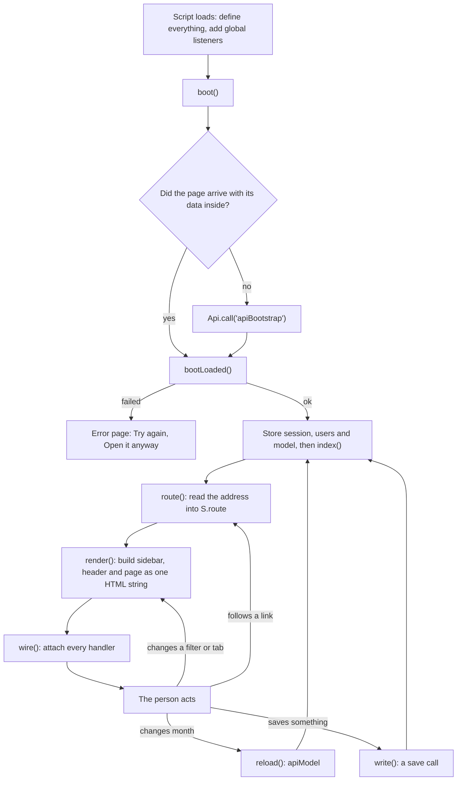

# KRA / KPI Tracker: frontend handover

This document explains the whole frontend of the KRA / KPI Performance Tracker: how the page is built, how it talks to the server, what every screen shows and where each figure comes from, how it is styled, and what to check before changing it.

It describes `Index.html` as of commit `6598c2c` (30 September 2026). Line numbers are from that commit and will drift. Function names are the stable reference: search for them.

Related files: `Code.gs` (the server), `appsscript.json` (the manifest), `DEPLOYMENT.md` (how code reaches dev and live).

## Contents

1. [What the frontend is](#1-what-the-frontend-is)
2. [Map of the file](#2-map-of-the-file)
3. [How the page works](#3-how-the-page-works)
4. [The contract with the server](#4-the-contract-with-the-server)
5. [The shell: sidebar and header](#5-the-shell-sidebar-and-header)
6. [Pages](#6-pages)
7. [Dialogs](#7-dialogs)
8. [Shared building blocks](#8-shared-building-blocks)
9. [Filters, month and "view as"](#9-filters-month-and-view-as)
10. [What a role can do](#10-what-a-role-can-do)
11. [Charts and exports](#11-charts-and-exports)
12. [Styling](#12-styling)
13. [Wiring reference](#13-wiring-reference)
14. [Rules to keep](#14-rules-to-keep)
15. [Changing the frontend safely](#15-changing-the-frontend-safely)
16. [Known issues and open items](#16-known-issues-and-open-items)
17. [Glossary](#17-glossary)
18. [History of the current design](#18-history-of-the-current-design)

---

## 1. What the frontend is

- **One file.** `Index.html` holds everything: one `<style>` block and one `<script>` block. There is no build step, no framework, no modules and no bundler.
- **Size.** 3,613 lines. The stylesheet is lines 13 to 782. The script is lines 786 to 3611.
- **Language level.** The script is one function wrapped in `(function(){ 'use strict'; ... })()`, written in ES5 style (`var`, function expressions, string concatenation). Keep to that style so the file stays uniform.
- **Where it runs.** It is a Google Apps Script web app. `doGet()` in `Code.gs` serves the file through `HtmlService`, and Google shows it inside a sandboxed frame. The page reaches the server only through `google.script.run`.
- **Outside resources**, all loaded in `<head>`:

  | Resource | Version | Used for |
  |---|---|---|
  | Poppins (Google Fonts) | weights 400, 500, 600, 700 | all text |
  | Chart.js | 4.4.1 | the monthly trend charts |
  | SheetJS `xlsx` | 0.18.5 | Excel export |
  | jsPDF | 2.5.1 | scorecard PDF |

- **It cannot be opened on its own.** Double-clicking `Index.html` shows an error screen, because `google.script.run` exists only inside Apps Script. See [section 15](#15-changing-the-frontend-safely) for ways to preview it.

## 2. Map of the file

| Lines | Contents |
|---|---|
| 1–12 | `<head>`: meta tags, title, font and library tags |
| 13–782 | Stylesheet (details in [section 12](#12-styling)) |
| 783–784 | `<body>` and the single mount point, `
` |
| 786–3611 | Script. The rows below are its parts |
| 790–810 | State (`S`, `M`, `CH`) and the smallest helpers (`$`, `$$`, `h`, `num`, `ini`, `f1`, `pc`) |
| 812–874 | `LOGO` (the Recykal symbol as an embedded PNG), `ICON` (icon path data), `svg()` |
| 876–919 | `toast()`, `Api` (the only door to the server), `write()` |
| 921–943 | `index()` and the permission helpers |
| 944–1109 | Formatting, KPI identity, `ovStats()` and its helpers, seniority order, `targetOf()` |
| 1110–1332 | Pivot and summary tables, the targets panel, target and achieved cells |
| 1333–1435 | Role names, period labels, team labels, filters, the header month selector |
| 1437–1535 | Level meter, score cell, tags, tiles, panels, notes; `stats()`, `flags()`, `weightWarnings()` |
| 1537–1607 | Charts |
| 1609–1910 | `V.overview` and `peopleTable()` |
| 1912–2076 | Team module: `V.teams`, `V.team`, cards, row layout, connector lines |
| 2077–2192 | `V.people` and `V.emp` (the person scorecard) |
| 2194–2294 | `V.framework` and `V.review` |
| 2296–2491 | `V.method` ("How it is calculated", static text) |
| 2492–2537 | `V.admin` |
| 2539–3123 | Dialogs |
| 3125–3208 | Exports (Excel, PDF) |
| 3210–3325 | Shell: `NAV`, `crumbs()`, `render()` |
| 3327–3397 | Boot screen and reveal animation |
| 3398–3493 | `wire()` (every event handler) and `debounce()` |
| 3495–3555 | Search, routing, `nav()`, global listeners |
| 3557–3609 | Model cache, `reload()`, `boot()`, `bootLoaded()` |

The script marks its sections with banner comments such as `// ===== OVERVIEW =====` and `// ===== TEAM MODULE =====`.

## 3. How the page works

### 3.1 Life cycle

1. The script defines everything, adds four global listeners (`hashchange`, a click listener for in-app links, `keydown`, `resize`), exposes `window.__PerfTracker` for debugging, and calls `boot()`.
2. `boot()` shows the boot screen and a skeleton, then asks the server for the first payload with `apiBootstrap`. If the page arrived with `window.__BOOT_INLINE__` already filled in, it uses that instead and makes no call.
3. `bootLoaded()` stores the session, the "view as" user list and the model, calls `index()` to build lookup tables, and routes to the address in the URL (or to Overview).
4. `route()` reads the address into `S.route` and `S.params`, closes any dialog, renders, and scrolls to the top.
5. `render()` builds the entire screen as one HTML string and assigns it to `#root`, then calls `wire()`.
6. Charts and the Teams connector lines are drawn just after render, in `setTimeout(..., 0)`, because they need the elements to exist.

### 3.2 Rendering model

- **Every change re-renders everything.** There is no virtual DOM and no partial update. A handler changes `S` and calls `render()`.
- **Handlers are re-attached on every render** by `wire()`, which looks elements up by `data-*` attributes and ids ([section 13](#13-wiring-reference)).
- **Dialogs live outside `#root`.** `openModal()` appends a `.scrim` element to `<body>` and binds the dialog's own controls, because `wire()` has already run by then.
- **A page that throws does not blank the app.** `render()` wraps the view in `try/catch` and shows "This page could not be rendered" with the message.
- **Escaping.** Every value that comes from data goes through `h()` before it enters an HTML string. Never concatenate a data value without it.

### 3.3 State

`S` is the only mutable application state.

| Field | Meaning |
|---|---|
| `loading` | True until the first payload arrives. Shows the skeleton. |
| `error`, `denied`, `refused` | The error page. `denied`: the server says this person has no access. `refused`: Google rejected the call before it reached the app. |
| `model` | The payload for the month on screen ([section 4.3](#43-the-model)). |
| `session` | Who is looking and what they may do ([section 4.4](#44-the-session-roles-and-scope)). |
| `users` | The list for the "Viewing as" selector. Empty unless the person may switch. |
| `period` | `'ytd'` or a period id such as `per_2026-08`. Starts as `'ytd'`. |
| `viewAs` | The user id being viewed as, or `null`. |
| `route`, `params` | The current page and its arguments, from the address. |
| `fDept`, `fMgr`, `fSub`, `fLadder` | The filters: department, manager, sub-group, rating scale. |
| `q` | The search text on the KRA / KPI page. |
| `periodBusy` | True while a month is loading. Shows "loading…" in the header. |
| `tblMonth` | The month chosen in each "Targets and achieved" table, by table key. |
| `teamSel` | The team shown on the Teams page. |
| `ovTrend` | The team chosen in each of the two trend panels: `{A: teamId, B: teamId}`. |
| `ovAll` | True when People performance shows everyone instead of the top 5. |
| `ovAlerts` | The Overview's notes, kept for the alerts dialog. |
| `reveal` | True for the first paint, to play the entrance animation once. |

Other module-level values:

| Name | Meaning |
|---|---|
| `M` | Lookup tables rebuilt by `index()` after every new model: `M.teams`, `M.emps`, `M.kras`, `M.kpis` (by id), `M.byEmp` (rows by person), `M.byTeam` (people by team), `M.overalls`. |
| `CH` | Live Chart.js instances by canvas id. `destroyCharts()` clears them at the start of every render. |
| `_modelCache` | Models already fetched, by period id, so going back to a month is instant. Cleared by `invalidateModelCache()`. |
| `_reloadSeq` | A counter so that only the newest month request may update the page. |
| `V` | The views. `V[S.route](S.params)` returns the page's HTML. |

### 3.4 Routing and navigation

Routes are the part of the address after `#/`.

| Address | View | Notes |
|---|---|---|
| `#/overview` | `V.overview` | The default |
| `#/teams` | `V.teams` | Shows `S.teamSel`, or the first team |
| `#/team/<teamId>` | `V.team` | Selects that team, then renders `V.teams` |
| `#/people` | `V.people` | |
| `#/emp/<employeeId>` | `V.emp` | A person's scorecard |
| `#/framework` | `V.framework` | KRA / KPI |
| `#/review` | `V.review` | Structure review |
| `#/method` | `V.method` | How it is calculated |
| `#/admin` | `V.admin` | Administration |

- **All in-app movement goes through `nav(to)`.** It sets `location.hash`. If the address cannot change, which happens inside some sandboxed frames and file viewers, it calls `route(to)` directly so the page still changes.
- **Plain links are intercepted.** One click listener on `document` catches every `<a href="#/...">` without a `target` and sends it through `nav()`. Without this, a link inside a sandboxed frame resolves against the frame's parent address and leaves the page.
- **Keyboard.** `Esc` closes a dialog. `/` moves focus to the search box when nothing else has focus.

### 3.5 Talking to the server

`Api.call(fn, args, ok, bad)` is the only place that touches `google.script.run`.

- If `google.script.run` is missing, it fails with "Open this page through the deployed Apps Script URL".
- `Api.explain()` recognises Google's own refusal ("requested document", `PERMISSION_DENIED`). That refusal nearly always means the browser is signed in to more than one Google account and the call went out under the wrong one. It adds the fix to the message and sets `refused`.

`write(fn, payload, okMsg)` is the helper every save uses. It adds `period_id` and `view_as`, disables the dialog's buttons, and on success closes the dialog, clears the model cache, stores the returned model, re-renders and shows a toast. On failure it shows the server's message and leaves the dialog open.

## 4. The contract with the server

### 4.1 Values injected by `doGet`

`doGet()` inserts one line at the start of the page's script.

| Global | When | Meaning |
|---|---|---|
| `window.__APP_URL__` | Always | The web app's address, rewritten to keep the visitor's own account. Used only for the "Open it anyway" link. |
| `window.__BOOT_INLINE__` | Only when the page is opened with `?inline=1` | The full `apiBootstrap` answer, computed on the server. `boot()` uses it instead of calling the server. |

### 4.2 Calls

Every function returns an object with `ok: true` on success. On failure it returns `{ok: false, error, where}` and the page shows `error`.

| Function | Arguments | Success payload | Called from |
|---|---|---|---|
| `apiBootstrap(periodId, viewAs)` | `'ytd'` or a period id; a user id or `null` | `{model, users, session}` | `boot()` |
| `apiModel(periodId)` | period id | `{model}` | `reload()` |
| `apiSaveActual(p)` | `employee_id, kpi_id, actual` or `manual_level`, `note` | `{level, model}` | Record performance dialog |
| `apiSaveTargets(p)` | `employee_id, kpi_id, t1..t5` | `{parsed, model}` | Target bands dialog |
| `apiSaveAssignment(p)` | `employee_id, assignment_id, kra_name, perspective, kpi_name, goal, weightage, source, unit` | `{model}` | Add or edit a KPI |
| `apiRemoveAssignment(p)` | `assignment_id, employee_id, reason` | `{model}` | Remove from scorecard |
| `apiCustomerDetail(p)` | `employee_id, period_id, view_as` | `{rows, totals, why}` | Customers dialog |
| `apiRecomputeAll(p)` | `period_id, view_as` | `{rows, model}` | Administration |
| `apiImportFromSource(p)` | `sheet_id, period_id, replace, view_as` | `{result, model}` | Administration |

Every `p` also carries `period_id` and `view_as`. Every call that changes data (the four saves, the recompute and the import) rejects `'ytd'`: a real month must be selected.

### 4.3 The model

`S.model` is what `buildModel_()` returns, after `scopeModel_()` has removed everything the viewer may not see.

| Key | Contents |
|---|---|
| `period_id` | The period this model describes |
| `ytd` | True for Year to date |
| `ytd_periods` | The period ids included in Year to date, otherwise `null` |
| `periods` | `{id, name, kind, sort, status}`. `status` is `locked`, `open` or `upcoming` |
| `settings` | `current_period`, `source_sheet_id`, `rollup` |
| `teams` | `{id, name, code, lead_id, note, status}` |
| `employees` | `{id, name, designation, team_id, sub_group, region, manager_id, status, email}`. `status: 'lead'` marks a team lead |
| `kras` | `{id, team_id, perspective, name, status}` |
| `kpis` | `{id, kra_id, name, goal, source, unit, status}` |
| `rows` | One per person and KPI: the scorecard rows (below) |
| `overalls` | By employee id (below) |
| `audit` | The 40 most recent audit entries: `{id, ts, actor, entity_type, entity_id, action, old_value, new_value, reason}` |
| `source_sheet_id` | The default source workbook for the import |
| `generated_at` | When the server built it |
| `scoped`, `scope_kind` | Set when the viewer sees only part of the organisation (`team` or `self`) |

**A row** (`model.rows[i]`):

| Field | Meaning |
|---|---|
| `employee_id`, `kra_id`, `kpi_id`, `assignment_id` | Keys |
| `weightage` | This KPI's share of the person's scorecard, in percent |
| `kpi`, `goal`, `source`, `unit` | The KPI's name and descriptors |
| `bands` | The five rungs, Target 1 to 5, as text for display |
| `values` | The same five rungs as numbers, `null` where a rung is not numeric |
| `kind` | `numeric`, `ordinal` or `qualitative` |
| `direction` | `higher_is_better` or `lower_is_better` for numeric ladders; `ordinal` or `manual` otherwise |
| `band_note` | The parser's remark, for example that the ladder is not monotonic |
| `plan_target` | The target for the period, or `null`. In Year to date it is the months' sum, or their mean when `plan_agg` is `mean` |
| `plan_agg` | `sum` or `mean` |
| `ladder_target` | For a rate KPI with no typed target: the ladder's Target 4 rung. For display only |
| `plan_unit` | Unit of target and actual: `cr`, `days`, `count`, `ratio` and others |
| `plan_source`, `plan_rule` | Where the target came from. `plan_rule` is shown as the tooltip on the target |
| `actual` | The achieved value. In Year to date: the sum or the mean, per `agg_kind` |
| `actual_note` | The note stored with the actual. Shown as the "working" link |
| `ratio` | Achieved divided by target, where the ladder is a percentage-of-target ladder. Drives "Target achievement" |
| `level` | The resulting level, 0 to 5, or `null`. Can be fractional in Year to date |
| `manual_level` | The awarded level for a ladder that is not numeric (single month only) |
| `monthly` | Year to date only: `{periodId: {target, actual, note}}` |
| `agg_kind`, `plan_months`, `actual_months`, `months_scored`, `months_total`, `ytd_basis` | Year to date only: how the year's figure was formed |
| `status` | The status of the performance record |

A row also carries `weightage_source`, `target_version` and `no_target_months`. The page does not use them.

**An overall** (`model.overalls[employeeId]`):

| Field | Meaning |
|---|---|
| `score` | The weighted mean of the person's levels, to two decimals, or `null` if nothing is scored |
| `level` | `score` rounded to a whole level, 1 to 5 |
| `assigned_weightage` | The sum of the person's weightages. Should be 100 |
| `measured_weightage` | The weightage of the KPIs that have a level |
| `kpi_count`, `scored_count` | How many KPIs, and how many have a level |
| `kra_levels` | The weighted mean level within each KRA, by KRA id |

### 4.4 The session, roles and scope

`S.session` holds `email`, `name`, `role_id`, `employee_id`, `admin`, `can_switch`, `perms` and `scope`.

| Role | Permissions | Sees |
|---|---|---|
| `super_admin` | everything (`*`) | everyone |
| `hr_admin` | `view`, `edit_target`, `edit_framework`, `enter_actual`, `admin`, `export` | everyone |
| `business_head` | `view`, `edit_target`, `edit_framework`, `enter_actual`, `export` | everyone |
| `team_leader` | `view`, `edit_target`, `enter_actual`, `export` | their team |
| `manager` | `view`, `enter_actual`, `export` | their team |
| `employee` | `view`, `enter_own` | themselves |
| `auditor` | `view`, `export` | their own scorecard if they have one, otherwise none |
| `no_access` | none | the "not open to you" page |

`scope.kind` is `all`, `team` (with `team_id`), `self` or `none`. The server removes out-of-scope people, rows, overalls, teams and audit entries from the model before it is sent, so the page never holds data the viewer may not see.

### 4.5 Failures

| Situation | What the page does |
|---|---|
| `apiBootstrap` returns `denied: true` | "This dashboard is not open to you", with the server's explanation |
| `apiBootstrap` returns another error | "Could not load Performance Tracker", with the message and **Try again** |
| Google refuses the call (`refused`) | The same page, plus **Open it anyway**, which reloads with `?inline=1` |
| A month fails to load | A toast. The figures on screen stay as they were, although the selector already shows the month that failed |
| A save fails | A toast. The dialog stays open with its values |

## 5. The shell: sidebar and header

Built in `render()` around every page.

**Sidebar**

- The brand lockup: the Recykal symbol (`LOGO`, an embedded PNG) with the lowercase wordmark "recykal" and the tagline "Sustainable Circularity".
- The menu, from `NAV`. Seven items in three groups: Performance (Overview, Teams, People), Framework (KRA / KPI, Structure review), System (How it is calculated, Administration). The group names appear only in the breadcrumb.
- The current item gets `.on`. Team pages light up Teams, and a person's scorecard lights up People.
- A card at the bottom: "Process, People, Profit, Planet" and "For a cleaner, greener tomorrow."
- At 900 px wide and below, the sidebar collapses to a 64 px strip of icons and the card is hidden.

**Header**

- The title "KRA / KPI Tracker" and the breadcrumb from `crumbs()`. The breadcrumb hides below 1,200 px.
- The month selector `#pSel`, from `headerPeriod()`. It is present on every page. Locked months read "(locked)".
- The search box `#gs` with its results list `#gsr` ([section 8](#8-shared-building-blocks)).
- "Viewing as" `#viewAs`, shown only when `session.can_switch` is true and there are users to choose from.
- The viewer's initials. The full name and role are in the tooltip.

**Boot screen.** `startBoot()` covers the page with the symbol and "Preparing your performance dashboard". It stays at least `BOOT_MIN_MS` (1,750 ms) and until the data arrives. `closeBoot()` then flies the symbol to its place in the sidebar, and `playReveal()` staggers the cards in. All of it is skipped when the visitor prefers reduced motion.

## 6. Pages

### 6.1 Overview (`V.overview`)

The Overview is presentation only. Every figure comes from `ovStats()`, `stats()` and the existing formatters. Nothing is calculated for display alone.

Layout, top to bottom:

1. Heading, the alerts button, a one-line description, and the three filters.
2. Six KPI cards.
3. Three cards: Performance health, KPI scoring breakdown, Weightage measured.
4. Department performance.
5. Two trend panels and People performance.
6. Summary by vertical.
7. Targets and achieved.

**Where each figure comes from**

`ovStats()` works on the people and rows that pass the filters.

| Figure | Definition |
|---|---|
| Employees | The number of people passing the filters. Beneath: how many have an overall score and how many are awaiting actuals |
| Avg Performance | The mean overall `score` across scored people, shown as a percentage of 5. Beneath: the level itself and the number of scorecards |
| Target Achievement | The mean of `ratio × 100` across targeted rows that have a ratio. Beneath: how many are at 100% or more |
| KPI Completion | Targeted rows that have an `actual`, divided by all targeted rows. A row is targeted when `targetOf(row)` has a value |
| Needs Attention | Scored people whose score is 3 or more and below 4 |
| Critical | Scored people whose score is below 3 |
| On Track | Scored people whose score is 4 or more |
| Not Scored | People with no overall score |
| Health bar | Each segment's width is its count divided by all people. The label inside is its share of scored people |
| KPI scoring breakdown | Rows by ladder kind: numeric, ordinal, qualitative, no ladder |
| KPI gap | Rows with no `level`. The line also gives total assignments, distinct KPIs (`distinctKpiCountIn`) and how many targeted rows are rated |
| Weightage measured | The weightage of rows that have a level, divided by all weightage |
| Department row | `ovFor(teamId)`: `ovStats()` with that department set as the filter. The row therefore equals the cards under that filter |
| Department "Top" badge | The department with the highest mean score among its scored people |
| Trend bar | `monthlyHitRate()`: for each month, the share of KPIs with both a target and an actual whose actual met the target (at or above it, or at or below it for lower-is-better) |
| People performance | People sorted by score, highest first. Top 5, or everyone after **View all** |
| People "Top" badge | The highest-scoring person |

**Interactions**

- Each KPI card, each health legend item and the KPI gap line opens a detail dialog ([section 7](#7-dialogs)).
- A department row opens that team. A person row opens that scorecard.
- The "Top" badges open their own dialogs. A click on a badge does not also trigger its row.
- The trend tabs choose a team per panel (`S.ovTrend`). The two panels are independent.
- The alerts button opens the notes that apply: a reduced scope, nothing recorded yet, ladders that need a decision, scorecards that do not total 100%.

**Notes**

- The trend charts need monthly data, which exists only in Year to date. In a single month the panels say "Nothing recorded yet".
- The labels "Top", "not scored", "awaiting actuals" and the dash for a missing value are shown exactly as they are. Do not reword or replace them.
- The reference design had a department "Status" column. It is not built, because the app has no rule for a department's status.

### 6.2 Teams (`V.teams`, `V.team`)

One team at a time, drawn as an organisation chart.

- **Tabs.** `teamTabs()` orders teams by `TEAM_TABS`: Metal, Plastic, Onboarding, Collections, Control Tower. A team is matched when its name contains the keyword. Any other team follows, under its own name.
- **Team header.** Team members, Total KPIs (distinct KPIs), KPI score (scored assignments out of distinct KPIs) and Average level. All from `teamFigures()`.
- **Team lead card.** The person in `team.lead_id`. If there is none, the card says "Not assigned".
- **Member cards.** Everyone else in the team, ordered by `bySeniority`. Each shows KPIs, Scored, Weightage, Target (the level as a meter) and Avg level, from `tmPerson()`. "Key responsibilities" lists the person's first three KRAs and "+N more".
- **Layout.** `arrangeTeamRows()` measures how many cards fit and spreads them evenly over the rows: 13 members at four a row become 4, 3, 3, 3. `drawTeamLinks()` draws the connector lines from the positions the cards actually took. Both run again on resize.
- A card opens that person's scorecard.
- The filters do not apply to this page.

### 6.3 People (`V.people`)

- The filter row and an **Export Excel** button.
- `peopleTable()`: people grouped by department, each group ordered by `bySeniority`. The group row gives the head count, the distinct KPIs and the average level.
- Columns: person (with a "Lead" tag), KPIs and how many are scored, weightage, score, level.
- A row opens the scorecard.
- **Export Excel** exports everyone in the model, whatever the filters show.

### 6.4 Person scorecard (`V.emp`)

- **Header.** Name, designation, department, sub-group. Buttons: **Customers**, **Scorecard PDF**, and **+ Add KPI** for those who may edit the framework.
- **Tiles.** Overall score, KPIs, Weightage (with a warning when it is not 100%), Measured, Level.
- **KRA rollups.** One line per KRA: number of KPIs, weight, and the level from `overalls.kra_levels`.
- **Rating scale mix.** The person's rows by ladder kind.
- **Scorecard.** One line per KPI, heaviest first:
  - Target ratings: the ladder kind and the five rungs. For a percentage-of-target ladder with a target, `ladderInUnits()` shows the rungs in the KPI's own units, with the percentages beneath.
  - Target: `targetCell()`. A target taken from the ladder is dotted and says "from the ladder".
  - Actual: `achievedCell()`. In Year to date it says whether it is a total or a monthly average and over how many months. A stored note appears as a link that opens the working.
  - Level: the meter.
  - Actions: **Actual**, **Bands** and **Edit**, each shown only to those who may use it, and only when a month is selected.

### 6.5 KRA / KPI (`V.framework`)

- Every assignment passing the filters: person, KRA and perspective, KPI, weight, ladder kind, the five rungs.
- The filter row gains a rating-scale filter and a search box that matches KPI and KRA names (`S.q`).
- Shows the first 400 rows and says so when there are more.
- **Export Excel** exports every row, not only the rows on screen.

### 6.6 Structure review (`V.review`)

Problems in the data that change how people are rated. Uses all rows, not the filtered ones.

- `flags()` finds:
  - **Critical:** a ladder that rewards a lower number on a KPI whose name reads as something to increase, and a numeric ladder that is not monotonic.
  - **Warning:** a KPI with no ladder at all, and a qualitative KPI that must be awarded by hand.
- `weightWarnings()` finds scorecards whose weightage is more than 0.5 away from 100.
- Three tiles give the counts. Three tables list the cases. A row opens the scorecard.

### 6.7 How it is calculated (`V.method`)

Static explanatory text: what each card means, the rating scale, achieved percentage, Year to date, the summary table, blank cells, and where the numbers come from.

It is written by hand. **When a rule changes in `Code.gs`, this page and `RATING_SCALE_UI` must be updated to match.**

### 6.8 Administration (`V.admin`)

Available to roles with `admin` or `edit_framework`. Everyone else sees "Not available to your role".

- **Import from the source workbook.** A spreadsheet id and a mode (merge or replace), then `apiImportFromSource`.
- **Recompute levels.** `apiRecomputeAll` for the selected month. Needs `admin`.
- **Audit trail.** The model's `audit` list: when, who, action, entity, detail.

Both actions need a month. In Year to date the buttons are still shown, and the server refuses the call with a message.

## 7. Dialogs

`shell(title, caption, body, footer, wide)` returns a dialog's HTML. `wide` is `true` for a wide dialog or `'cards'` for the widest. `openModal(html)` shows it and `closeModal()` removes it. A dialog closes on its close buttons, on a click outside it, and on `Esc`.

| Dialog | Opened by | What it does |
|---|---|---|
| Card details (`cardDetail(key)`) | `data-go="card:<key>"` | Shows the arithmetic behind a card, split by department. Keys: `employees`, `avg`, `attain`, `completion`, `top`, `ok`, `warn`, `crit`, `gap`, `dept` |
| Alerts | The alerts button | Lists the Overview's notes |
| How this was calculated (`modalWorking`) | The working link under an actual | Breaks a stored note into its parts. It understands the DSO note format and otherwise shows the note as it is |
| Customers (`modalCustomers`) | **Customers** | Calls `apiCustomerDetail` and lists the customers behind a person's figures |
| Record performance (`modalActual`) | **Actual** | A number for a numeric ladder, otherwise an awarded level, plus a note. Saves with `apiSaveActual` |
| Target bands (`modalTargets`) | **Bands** | Five free-text rungs. A live preview says how the ladder will be read (numeric and its direction, ordinal, or qualitative) and warns when it is not monotonic. Saves with `apiSaveTargets` |
| Add or edit a KPI (`modalAssign`) | **+ Add KPI**, **Edit** | KRA, perspective, KPI, goal, weightage, source, unit. Saves with `apiSaveAssignment` |
| Remove from scorecard | Inside the edit dialog | The first click adds a reason box to the dialog. The second click removes the KPI with `apiRemoveAssignment` |

The band preview in `modalTargets` repeats the server's parsing rules so the person sees the outcome before saving. If `parseBands_` changes in `Code.gs`, change the preview with it.

The removal reason is asked inside the dialog on purpose. `window.prompt`, `confirm` and `alert` are refused in embedded frames, so the app does not use them.

## 8. Shared building blocks

| Function | Returns or does |
|---|---|
| `h(s)` | Escapes text for HTML. Use it on every data value |
| `num(v)` | A number from text, ignoring commas, `%` and the rupee sign. `null` if there is none |
| `f1(v)`, `pc(v)` | One decimal place; a rounded percentage. Both give a dash for a missing value |
| `fmtTarget(v, unit, exact)` | A target or actual in its unit: crore to two decimals, whole days, a ratio as a percentage, a count |
| `crore(v)` | Rupees as crore, two decimals |
| `ini(name)` | Initials for an avatar |
| `svg(name)` | An icon from `ICON` |
| `toast(msg, kind)` | A message at the bottom of the screen. `kind: 'err'` stays longer |
| `person(e)` | Avatar, name and designation |
| `levelMeter(level, label)` | The five-segment meter and "Target N" |
| `scoreCell(o)` | "3.4 / 5" or "not scored" |
| `kindTag(kind)` | The ladder-kind tag |
| `tile()`, `panel()`, `note()`, `emptyBox()` | The tile, the card, the coloured note and the empty state |
| `filterRow(want)` | The filter row. `want.ladder` and `want.search` add controls; `want.cls` adds a class |
| `targetOf(row)` | `{v, derived}`: the typed target, otherwise the ladder's Target 4 rung marked as derived |
| `targetCell(row)`, `achievedCell(row, month)` | The target and actual cells, with their small print |
| `stats(rows)` | Counts over rows: total, scored, by level, by ladder kind, weight, measured weight |
| `ovStats()` | Everything the Overview shows ([section 6.1](#61-overview-voverview)) |
| `flags(rows)`, `weightWarnings()` | The data problems listed in Structure review |
| `kpiIdentity()`, `distinctKpiCountIn()` | Count distinct KPIs by KRA name and KPI name together, ignoring case and punctuation |
| `bySeniority(a, b)` | Lead first, then grade from the designation (`GRADES`), then name |
| `teamLabel(t)` | The team's display name. `TEAM_SHORT` shortens "Open Marketplace - Control Tower" to "OMP_CT" |
| `periodLabel(p)`, `periodName(id)` | "August 2026", or "Year to date" |
| `search(q)` | The header search: people, departments and KPIs, from two characters |
| `debounce(fn, ms)` | Delays a handler until typing pauses |

## 9. Filters, month and "view as"

**Filters**

- Department, manager, sub-group, and on the KRA / KPI page the rating scale and a search box.
- They are global. Set on one page, they stay set on the others. "Clear N filters" resets all of them.
- `filteredEmployees()` and `filteredRows()` apply them. Overview, People and KRA / KPI use these. Teams, Structure review and a person's scorecard do not.
- The manager filter keeps the manager as well as the people who report to them.

**Month**

- The selector is in the header. Changing it calls `reload()`.
- `reload()` uses `_modelCache` when it has the month. Otherwise it calls `apiModel` and shows "loading…". If the person changes month again before the answer arrives, the older answer is dropped.
- **Year to date is read-only.** `editable()` is false, so the Actual, Bands, Edit and Add buttons are hidden. The server also rejects any write to it.
- In a locked month, only `super_admin` and `hr_admin` may record an actual. The server enforces this; the page still shows the button.

**View as**

- Shown to those with `can_switch`. Choosing a user sets `S.viewAs` and calls `boot(true)`, which fetches a new bootstrap for that user without the boot screen.
- The session, permissions and model then describe that user. Every write carries `view_as`, and the server checks it again.

## 10. What a role can do

The page hides what a role cannot use. The server checks every call regardless, so the page's checks are for clarity, not for security.

| Helper | True when |
|---|---|
| `can(action)` | The session's permissions include the action, or `*` |
| `inScope(employeeId)` | The person is within the viewer's scope |
| `editable()` | A month is selected, not Year to date |
| `mayActual(id)` | `editable()`, in scope, and either `enter_actual`, or `enter_own` for the viewer's own scorecard |
| `mayTargets(id)` | `editable()`, in scope, and `edit_target` |
| `mayFramework(id)` | `editable()`, in scope, and `edit_framework` |

## 11. Charts and exports

**Charts**

- One chart type: the monthly bar chart, `chartMonthly(id, rows, color)`.
- `baseOpts()` reads colours and the font from the CSS tokens through `tok()`, so charts follow the stylesheet.
- The axis shows a short month over the year ("Apr" above "2026") so six months fit. The tooltip shows the full month name.
- `mkChart()` does nothing if Chart.js failed to load. The rest of the page still works.

**Exports**

- `exportXl('people' | 'framework')` builds a workbook with SheetJS from `xlRows()` and saves it.
- `exportPdf(employeeId)` builds a one-person scorecard with jsPDF.
- Both depend on a browser download. Inside a viewer that blocks downloads they do nothing.
- The PDF uses Helvetica, the font built into jsPDF, not Poppins.

## 12. Styling

### 12.1 Layers

The stylesheet was built in layers, and later layers override earlier ones.

| Lines | Layer |
|---|---|
| 14–32 | Tokens (`:root`) |
| 33–138 | Base, boot screen, definition lists, the summary table (`.sum`) and the pivot table (`.pv`) |
| 140–419 | The original shell and components |
| 420–482 | Team module (`.tm-*`) |
| 483–657 | The redesigned shell and the Overview (`.ov-*`) |
| 658–781 | The brand pass. It is last, so it wins |

To restyle a component, add to or edit the brand pass. If a rule seems to have no effect, look for a later rule with the same selector.

### 12.2 Tokens

| Token | Value | Use |
|---|---|---|
| `--ink`, `--ink-2`, `--ink-3` | `#111111`, `#5a5a5a`, `#8a8a8a` | Text: main, secondary, faint |
| `--line`, `--line-soft` | `#e3e5e9`, `#eef0f3` | Borders |
| `--page` | `#f7f7f9` | Page background |
| `--surface`, `--raised`, `--sunken` | `#ffffff`, `#f4f4f4`, `#f8f8f8` | Card and control surfaces |
| `--accent` | `#111111` | Focus ring and the default chart colour |
| `--rk`, `--rk-s` | `#005dff`, `#ebf2ff` | The accent and its tint: active menu item, tabs, badges, bars |
| `--blue`, `--blue-s` | `#005dff`, `#ebf2ff` | Links, the weightage ring, info notes |
| `--violet`, `--violet-s` | `#8460d4`, `#f3effb` | The second trend panel |
| `--st-ok`, `--st-warn`, `--st-crit` | `#049769`, `#f58220`, `#e23d3d` | Status: on track, needs attention, critical |
| `--ok-s`, `--warn-s`, `--crit-s` | tints | Status backgrounds |
| `--good`, `--warn`, `--crit` | `#049769`, `#b85c10`, `#d12e2e` | Status colours dark enough for text |
| `--lv1` to `--lv5` | `#99bbff` to `#024c8a` | The level meter, light to dark |
| `--lvna`, `--lv0` | `#eceef2`, `#d8d8d8` | Unfilled meter segments |
| `--cat1`, `--cat2`, `--cat3`, `--cat-rest` | near-black to light grey | Ladder kinds in the scoring bars |
| `--head` | `#111111` | Headings inside tables |
| `--r-lg`, `--r`, `--r-sm` | 14, 10, 7 px | Corner radii |
| `--font` | Poppins, then system fonts | All text |

### 12.3 Brand rules

From the Recykal brand guidelines:

- **Typeface:** Poppins.
- **Palette:** black, Bright Blue `#005DFF`, Midnight Blue `#024C8A`, Medium purple `#8460D4`, Blue `#567DE8`, Bright Green `#1DC797`, Dark Green `#049769`, Duke Blue `#0000AF`, Fern Green `#3E7D44`. **There is no orange in the palette.**
- **Logo:** the symbol on the left, then the lowercase wordmark "recykal". Tagline: "Sustainable Circularity". Never "RECYKAL" or "Recykal", never on a coloured or gradient background, never rotated, stretched or outlined.

How the app applies them:

- The accent is Bright Blue. Primary buttons and the "Lead" tag are black.
- Orange and red appear only as the status colours for "needs attention" and "critical". On-track green is the brand's Dark Green.
- Department icons and charts use palette colours (`OV_TEAM_ICON`, the two trend colours).
- Colour carries meaning only for status and for interactive elements. Other text is black or grey.

### 12.4 Components

| Class | What it is |
|---|---|
| `.app`, `.sb`, `.main`, `.top`, `.content` | The page grid, sidebar, main column, header and page body |
| `.sb-brand`, `.sb-nav`, `.sb-i`, `.sb-tag` | Sidebar parts. `.sb-i.on` is the current item |
| `.hdr` | A page heading row: `h1`, `.sub`, and buttons on the right |
| `.panel`, `.panel.flush`, `.ph` | A card. `flush` has no padding, for tables. `.ph` is its header |
| `.tile` | A figure tile: `.l` label, `.v` value, `.h` hint |
| `.row` with `.r-2`, `.r-3`, `.r-4`, `.r-5`, `.r-21` | Grid rows of equal columns. `.r-21` is a wide and a narrow column |
| `.filters`, `.f` | The filter row and one filter |
| `.tw` | A horizontal scroll container for a table |
| `table`, `tr.grp`, `tr.clk`, `td.r`, `td.act`, `.num` | Tables. Group rows, clickable rows, right-aligned cells, the sticky actions column, tabular numbers |
| `.btn`, `.btn.p`, `.btn.sm` | Buttons: default, primary, small |
| `.tag` with `.b`, `.o`, `.a`, `.g` | Pills: black, grey, outlined, faint |
| `.note` with `.i`, `.w`, `.c` | Notes: info, warning, critical |
| `.lv`, `.lv-t`, `.lv-na` | The level meter, its text, and "not scored" |
| `.scrim`, `.modal`, `.m-h`, `.m-b`, `.m-f` | A dialog: backdrop, box, header, body, footer |
| `.fld`, `.bands`, `.hint` | Form fields in dialogs |
| `.toast` | The bottom message |
| `.sum`, `.pv` | The summary-by-vertical table and the POC by KRA pivot |
| `.vcard`, `.sbs`, `.calc`, `.sumline` | Pieces of the card-detail dialogs |
| `.ov-*` | Overview only: `.ov-kpi`, `.ov-card`, `.ov-hbar`, `.ov-hleg`, `.ov-lg`, `.ov-ring`, `.ov-dt`, `.ov-ppl`, `.ov-tabs`, `.ov-chart` |
| `.tm-*` | Teams only: `.tm-sel`, `.tm-ov`, `.tm-chart`, `.tm-lead`, `.tm-card`, `.tm-links` |
| `.derived` | A dotted underline for a target taken from the ladder |
| `.boot`, `.rev` | The boot screen and the entrance animation |

### 12.5 Breakpoints

| Width | What changes |
|---|---|
| 1,500 px and below | People performance moves under the two trend panels. KPI card titles may wrap to two lines |
| 1,440 px and below | Performance health takes a full row. The other two cards share the next |
| 1,360 px and below | KPI cards go three to a row |
| 1,200 px and below | The breadcrumb hides. Header controls narrow |
| 1,180 px and below | Tile rows of four or five go to three. Two-column rows stack |
| 1,120 px and 960 px | Optional table columns hide (`.opt2`, then `.opt1`) |
| 900 px and below | The sidebar collapses to icons. Overview cards stack |
| 600 px and below | The header wraps to several lines. Filters and KPI cards stack |

Checked at 1,366, 1,536 and 1,920 px wide and at phone width. The page body never scrolls sideways. Only wide tables do, inside `.tw`.

## 13. Wiring reference

`wire()` attaches these after every render.

| Selector | Event | Action |
|---|---|---|
| `#pSel` | change | Set `S.period`, then `reload()` |
| `#viewAs` | change | Set `S.viewAs`, then `boot(true)` |
| `#gs` | input, focus, blur | `search()`; hide the results on blur |
| `[data-go="<route>"]` | click | `nav('#/' + route)` |
| `[data-go="card:<key>"]` | click | Open the card-detail dialog. An unknown key goes to `#/method` |
| `[data-ovtab="A\|<teamId>"]` | click | Choose the team for a trend panel |
| `[data-ovall]` | click | Toggle top 5 and everyone |
| `[data-ovalerts]` | click | Open the alerts dialog |
| `[data-team="<teamId>"]` | click | Select a team tab |
| `[data-f="<field>"]` | change | Set the filter `S[field]`, then render |
| `[data-fq]` | input | Set `S.q`, render, keep the cursor in the box |
| `[data-clear]` | click | Clear every filter and the search text |
| `.tblm[data-tbl="<key>"]` | change | Choose the month of one "Targets and achieved" table |
| `[data-work="<emp>\|<kpi>\|<month>"]` | click | `modalWorking` |
| `[data-cust="<emp>"]` | click | `modalCustomers` |
| `[data-actual="<emp>\|<kpi>"]` | click | `modalActual` |
| `[data-targets="<emp>\|<kpi>"]` | click | `modalTargets` |
| `[data-assign="new:<emp>"]` or `"<assignment>:<emp>"` | click | `modalAssign` |
| `[data-xl="people"]`, `[data-xl="framework"]` | click | `exportXl` |
| `[data-pdf="<emp>"]` | click | `exportPdf` |
| `[data-close]` | click | `closeModal` |
| `#impGo`, `#recalcGo` | click | The Administration actions |

Ids used inside dialogs: `#aVal`, `#aLvl`, `#aNote`, `#aSave` (record performance); `#t1` to `#t5`, `#tPrev`, `#tSave` (bands); `#gKra`, `#gPer`, `#gKpi`, `#gGoal`, `#gW`, `#gSrc`, `#gU`, `#gSave`, `#gDel`, `#gWhyT` (assignment); `#custBody` (customers); `#impId`, `#impMode` (import).

A click handler on a row ignores clicks that start on a button inside it, so a badge in a row does not also open the row.

For debugging in the browser console: `window.__PerfTracker` exposes `S`, `M`, `V`, `boot`, `render` and `index`.

## 14. Rules to keep

These were set by the product owner and the redesign was checked against them.

1. **The server is the single source of truth.** The page displays what it receives. It does not change, recalculate, reinterpret, round differently, rename or merge any value, and it never invents a value.
2. **Show missing values as they are.** A dash, "not scored", "awaiting actuals" and the other empty states stay exactly as worded.
3. **Design changes are presentation only.** If a change needs a new figure, that figure belongs in `Code.gs`, not in the page.
4. **Escape every data value with `h()`.**
5. **No `alert`, `confirm`, `prompt` or `eval`.** Embedded frames refuse them.
6. **Move between pages with `nav()`** or a plain `#/...` link, never by assigning `location.hash` directly.
7. **Follow the brand** ([section 12.3](#123-brand-rules)).
8. **Dev first.** Nothing goes to the live app until it has been checked on dev and the owner says so. See `DEPLOYMENT.md`.

## 15. Changing the frontend safely

**Where to preview**

| Way | How | Limits |
|---|---|---|
| The dev link | Put the code in the Apps Script project and open **Deploy → Test deployments** (the address ends in `/dev`). It always runs the saved code | You must have edit access to the project |
| The live link (`/exec`) | Shows the last deployed version only | It does not change when code is saved |
| A standalone preview | The page with the real `Code.gs` running inside it against a copy of the database, behind stand-ins for the Apps Script services and a stand-in `google.script.run` | The tooling for this is not in the repository yet. The customers dialog and the import cannot work in it, because they read other spreadsheets |

**Checks used for the redesign.** Repeat them after any change.

1. **No text changed.** Collect the text of every page before and after the change, using `textContent`, which CSS does not affect, and compare. The last full run, at commit `0345657`, covered 47 pages: the 7 main pages, 5 teams and 35 people.
2. **Layout.** At 1,366, 1,536 and 1,920 px wide and at phone width, look for cut-off text, sideways page scroll, anything spilling out of its card, and overlapping header controls.
3. **Click-through.** Every menu item, every card dialog, the health legend, trend tabs, "View all", a department row, a filter, a month change and back, "view as" and back, each team tab, a member card, a people row, recording an actual, recalculating, search, and both exports.
4. **Console.** No errors.
5. **A locked-down frame.** Open the page inside `<iframe sandbox="allow-scripts">` and click the menu. This is what caught the navigation problem that `nav()` fixes.

**Deploying.** See `DEPLOYMENT.md`. Each push of `Code.gs`, `Index.html` or `appsscript.json` is meant to deploy to dev automatically. That needs a one-time setup that has not been done, so for now the code is pasted into the Apps Script editor by hand.

## 16. Known issues and open items

**In the frontend**

1. **"View as" is lost when the month changes.** `reload()` calls `apiModel(periodId)` with no "view as", and the server's `apiModel` resolves the real user. The model that comes back is for the real user, while the session on screen still belongs to the viewed user. Also, `_modelCache` is not cleared when "view as" changes, so a cached month can belong to the previous identity.
2. **The month cache goes stale after an import or a recompute.** Those two handlers replace `S.model` but do not call `invalidateModelCache()`. Going to another month and back can show the figures from before the action. `write()` does this correctly and is the pattern to follow.
3. **The note box in "Record performance" starts empty.** It reads `row.note`, but the field on a row is `actual_note`. Nothing is lost: leaving the box empty keeps the stored note.
4. **The UAT banner never appears.** `render()` shows it when `session.open_access` is set, but `apiBootstrap` does not include that field in the session it returns.
5. **No department "Status" column** on the Overview, because there is no rule that defines a department's status.
6. **Names are matched in code.** `TEAM_TABS`, `TEAM_SHORT`, `OV_TEAM_ICON`, `VERTICAL_ORDER` and `GRADES` contain team names and designations. A renamed or new team still appears, after the known ones and with a generic icon. An unknown designation sorts last.
7. **Limits.** KRA / KPI shows 400 rows. Card-detail tables show 60. Search returns at most 6 people, 4 departments and 6 KPIs. The audit trail holds 40 entries.
8. **"How it is calculated" is written by hand** and must be kept in step with the rules in `Code.gs`.
9. **Clickable rows and cards cannot be reached from the keyboard.** They are `div` and `tr` elements with click handlers and no `tabindex`.
10. **The PDF is set in Helvetica,** not Poppins.
11. **A month that fails to load leaves the selector ahead of the data.** The handler sets `S.period` before the answer arrives and does not set it back on failure.

**Around the frontend**

12. **The live app does not have this frontend.** It was edited directly in its Apps Script editor on 30 September 2026. That edit reduces the Overview to "Summary by vertical" and moves everything else to Teams, which conflicts with this design. The owner has not yet decided which one goes live. Those edits also need merging before anything is promoted.
13. **Automatic deployment is not set up.** The workflow runs on every push of the app's files and fails until the credentials are added. That failure says nothing about the code.
14. **This repository is public.** `Code.gs` contains the built-in seed data, which includes staff names and KPI structures, and internal spreadsheet ids.
15. **Server-side issues reported on 29 September 2026 and not yet fixed.** They affect what the page shows. Check each against the current code before relying on it:
    - The three OMP importers report rows written but never save them.
    - On-time transit can mark a shipment late before its grace period ends.
    - In Year to date, the achieved value of some rate KPIs is summed across months instead of averaged.

## 17. Glossary

| Term | Meaning |
|---|---|
| KRA | Key result area: a group of KPIs, such as "GMV" or "DSO Days" |
| KPI | The measure inside a KRA. The same KPI name can sit under several KRAs, so a KPI is identified by KRA and name together |
| Assignment | One KPI held by one person, with its own weightage, ladder, target and rating. The row of a scorecard |
| Scorecard | All of one person's assignments. The weightages should total 100% |
| Ladder, bands, Target 1 to 5 | The five rungs that decide the rating for a KPI |
| Target | The single figure to reach in a period, such as 9 sellers or 6.50 Cr. Not the same as a rung |
| Actual, achieved | What was reached in the period |
| Level, rating | 0 to 5 for one KPI: the highest rung cleared, counting up from Target 1 without a gap |
| Score | A person's weighted mean level across their scored KPIs, out of 5 |
| Percentage-of-target ladder | A ladder whose rungs are fractions of the target (0.6, 0.75, 0.9, 1.0, 1.05). Target 4 is 100% |
| Derived target | For a rate KPI with no typed target: the ladder's Target 4 rung, shown dotted |
| Year to date (YTD) | All months that are not upcoming, combined. Read-only |
| POC | The person responsible for a KRA |
| Vertical, department, team | The same thing: Metal, Plastic, Onboarding, Collections, Open Marketplace - Control Tower |
| Lead | The person in a team's `lead_id`. Their `status` is `lead` |
| Scope | How much of the organisation a role sees: all, team, self or none |

## 18. History of the current design

| Commit | Date | Change |
|---|---|---|
| `911bdc9`, `0a2eed5` | 29 Sep 2026 | Synced with the live Apps Script project |
| `8fa7e7f`, `cccd181`, `b179b18` | 29 Sep 2026 | Removed dead code and long comments. Behaviour unchanged |
| `11014b5`, `67cfbb9`, `c78a642` | 29 Sep 2026 | Clear load errors, and "Open it anyway" for when Google refuses the data call |
| `0704cc2` | 29 Sep 2026 | A fixed super admin on the server |
| `b24e7b7` | 29 Sep 2026 | Deployment workflows: dev automatically, live by hand |
| `adf7564` | 29 Sep 2026 | Team module: one team at a time, as an organisation chart |
| `6600fef` | 29 Sep 2026 | Merged the sandbox project's changes: targets derived from the ladder, seniority order |
| `83e59c3` | 29 Sep 2026 | Overview redesign and the new shell. Presentation only |
| `aba5de3` | 30 Sep 2026 | Brand pass: palette, logo, one look on every page, alignment fixes |
| `0345657` | 30 Sep 2026 | Navigation that works inside any frame. Header fix |
| `6598c2c` | 30 Sep 2026 | The removal reason is asked inside the dialog |
